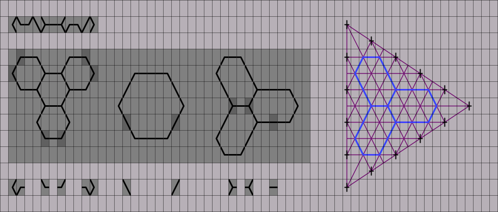

# Hexagonal drawing characters

A monospace font used to draw hexagonal characters in flat files or a terminal.

## Large flat-top hexagons

Character set, examples and construction:

## Large pointy-top hexagons

Character set, examples and construction:

## Small flat-top hexagons

Coming soon

## Small pointy-top hexagons

Coming soon
