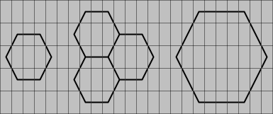
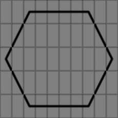
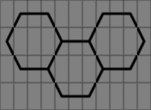
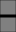
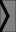
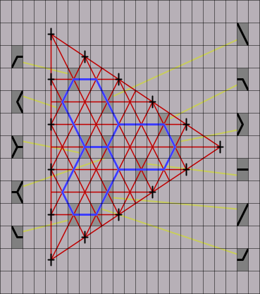

# Hexagon-drawing characters

A monospace characters set designed to draw hexagonal characters, that can be used in flat files or a terminal.

It aims to be the equivalent of the [box-drawing characters](https://en.wikipedia.org/wiki/Box_Drawing) for hexagons. Like this last, the hexagon-drawing characters are designed with 3 line styles: *light*, *heavy* and *double*.

## Large Flat-top Hexagon Drawings

This set is composed of 11 shapes:
- 1 horizontal bar;
- 6 corners;
- 2 forks used to connect hexagons;
- 2 diagonal bars used to extend the hexagons in order to get bigger ones.

The smallest hexagon in this set can be drawn on a 5x3 grid.

It contains 3 free slots in the center, that can be used to include any other monospace character.

### Examples of use

#### Minimal hexagon

#### Extended hexagon

#### Hexagonal tiling

### Representation

#### Light

*Coming soon*

#### Heavy

| image | name | note |
|-------|------|------|
| **Lines** |||
|  | heavy straight line horizontal | similar to `━`: `\u2501` - Box Drawings Heavy Horizontal |
|  | heavy diagonal falling | |
|  | heavy diagonal rising | |
| **Corners** |||
|  | heavy corner lower left | |
|  | heavy corner lower right | |
|  | heavy corner left | |
|  | heavy corner right | |
|  | heavy corner upper left | |
|  | heavy corner upper right | |
| **Forks** |||
|  | heavy fork left | |
|  | heavy fork right | |

#### Double

*Coming soon*

### Construction

*Each crosshair is located on the center of its surrouding box.*

## Large Pointy-top Hexagon Drawings

This set is composed of 15 shapes:
- 1 vertical bar;
- 6 corners;
- 2 forks;
- 2 centered diagonal bars;
- 4 shifted diagonal bars, used to extend the hexagons in order to get bigger ones.

Like in the flat-top set, the smallest hexagon in this set can be drawn on a 5x3 grid.

It also contains 3 free slots in the center, that can be used to include any other monospace character.

### Construction

Each crosshair is located on the center of its surrouding box.

### Representation

#### Light

*Coming soon*

#### Heavy

Characters representation, examples and construction:

The vertical bar is supposed to be similar to `┃` (`\u2503`: Box Drawings Heavy Vertical)

#### Double

*Coming soon*

## Small flat-top hexagons

*Coming soon*

## Small pointy-top hexagons

*Coming soon*
