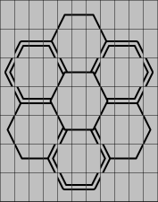
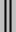

# Hexagon-drawing characters

A monospace character set designed to draw hexagonal characters, that can be used in flat files or a terminal.

It aims to be the equivalent of the [box-drawing characters](https://en.wikipedia.org/wiki/Box_Drawing) for hexagons. This set is designed with 2 line styles: *simple* and *double*, and allow mixing both.

## Large flat-top hexagons

This set is used to draw flat-top hexagons and contains 34 glyphs.

The smallest hexagon can be drawn on a 5x3 grid and contains 3 free slots in the center of each hexagon, that can be used to include any other monospace character.

### Simple lines (11 glyphs)

### Double lines (11 glyphs)

### Mixed (12 glyphs)

## Large pointy-top hexagons

This set is used to draw pointy-top hexagons and contains 42 glyphs.

Like in the flat-top set, the smallest hexagon can be drawn on a 5x3 grid and also contains 3 free slots in the center of each hexagon, that can be used to include any other monospace character.

### Simple line (15 glyphs)

### Double line (15 glyphs)

### Mixed (12 glyphs)

## Small pointy-top hexagons

This set is used to draw small pointy-top hexagons.

The smallest hexagon can be drawn on a 3x3 grid and contains 1 free slot in the center of each hexagon, that can be used to include any other monospace character.

### Simple line (9 glyphs)

Considering the hight amount of glyphs required to draw each combination of mixed-line forks, this character set is only provided in simple-line style.
